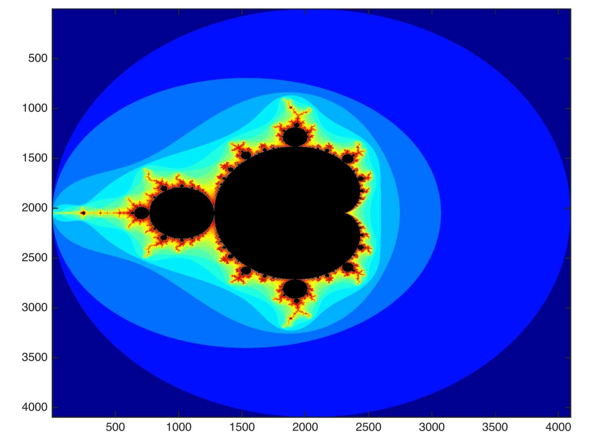
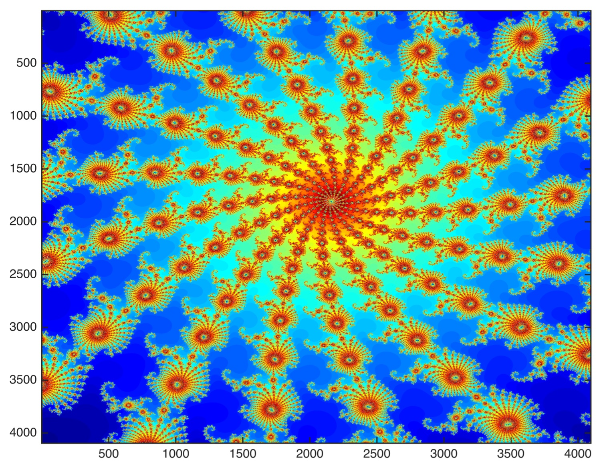

# Parallelization (FFT and Fractals)

## Introduction

In parallel computing, problems are often categorized based on how easily they can be divided into smaller, _independent_ tasks that can be processed in parallel. The two main categories which we will investigate here are **embarrassingly parallel** and **non-embarrassingly parallel** problems.

### Characteristics:
- **Embarrassingly Parallel**:   
  - Each task can be executed independently with no or minimal need for communication between tasks.
  - The speed-up scales near linearly by adding more compute.
- **Non-embarrassingly Parallel**: 
  - Tasks are dependent on one another and require synchronization or communication or data sharing between subproblems.
  - Scaling is not trivial, e.g. you might run into diminishing returns sort of problems (e.g. too much communication overhead).

Here, we will look into two algorithms: 1) the Fast Fourier Transform (non-embarrassingly parallel) and 2) Mandelbrot set calculation (embarrassingly parallel).

## 1. Parallel Fast Fourier Transform (FFT) using MPI

## Overview
This project implements the forward Binary Exchange FFT using parallel processing with MPI (Message Passing Interface) and the Bit Reversal technique. The purpose of the project is to benchmark the method against the non-parallel version of it. The algorithm will generate a random sequence of numbers $\in \mathbb{R}$, of length $N$ (user defined, $N \in  \{2^k : k \in ℕ\}$), and then it will calculate its FFT. The FFT algorithm has a time complexity of $O(N \log N)$. For the gory details on the twiddle factors, the butterfly opperations and the flow in general of the inner workings of the parallel algorithm, look into the report [here](assets/FFT_Parallel_final.pdf). 

## Prerequisites
You need the following installed:
- **MPI Library** (e.g. OpenMPI)
- **GCC or Clang** with MPI support
## Installation , Compilation & Usage
1. Clone the repository:
   ```bash
   git clone https://github.com/ntat/Parallelization_FFT_Fractals.git
   cd FFT
   ```
2. Compile using `mpicc`:
   ```bash 
   mpicc -o myfft fft_final.c -lm
   ``` 
3. Run the program with `mpirun`, specifying the number of processes (`-np`), which _must_ be a power of two:
   ```bash 
   mpirun -np <num_processes> myfft <N> <debugMode> <printResults>
   ```
 - `N` (integer): Input size (_must_ be a power of two).
 - `debugMode` (0/1): If `1`, saves the FFT input to `InputFFT.txt`
 - `printResults` (0/1): If `1`, saves the FFT output (in correct order / not bit flipped) to `OutputFFT.txt`
4. Example:
   ```bash 
   mpirun -np 4 myfft 1024 1 1
   ```
This will calculate the FFT on 4 processes, and it will return the randomly generated sequence of length N=1024, as well as its FFT calculation in case you need it.

## Results
Results compiled on an Intel Xeon Haswell-based cluster. 
<p  align="center">  
  
  
</p>

<p  align="center">  
  
</p>

## 2. Parallel Mandelbrot Set using MPI

## Method Overview

The Mandelbrot set is computed by iterating the function:

$$
z_{n+1} = z_n^2 + c,
$$

where:

- $c \in \mathbb{C}$, represents a point in the complex plane (mapped from a pixel),
- $z_0 = 0$,
- The iteration continues until either

$$
\lvert z_n \rvert \geq 2
$$

(indicating divergence) or a maximum number of iterations $N$ is reached.

For each pixel corresponding to the complex number $c$, the algorithm computes the number of iterations $k$ required for divergence (or $k = N$ if the sequence does not diverge). This iteration count is then used to determine the pixel's color.

# Mapping the Complex Plane

The image is generated by mapping a rectangular portion of the complex plane to a grid of pixels. Let:

$$
\text{Re}(c) \in [\text{MinRe}, \text{MaxRe}], \quad \text{Im}(c) \in [\text{MinIm}, \text{MaxIm}].
$$

The step sizes along the real and imaginary axes are given by:

$$
\Delta x = \frac{\text{MaxRe} - \text{MinRe}}{w - 1}, \quad \Delta y = \frac{\text{MaxIm} - \text{MinIm}}{h - 1},
$$

where $w$ and $h$ are the width and height of the image, respectively.

# Zooming Functionality

Zooming is achieved by redefining the boundaries of the complex plane. For a selected pixel $(x_0, y_0)$ and a zoom factor $f$, a new window is defined by:

$$
x \in [x_0 - f, x_0 + f], \quad y \in [y_0 - f, y_0 + f].
$$

These pixel coordinates are then translated back to complex plane coordinates, resulting in updated boundaries:

$$
\begin{aligned}
\text{newMinRe} &= \text{MinRe} + \Delta x \cdot (x_0 - f), \\
\text{newMaxRe} &= \text{MinRe} + \Delta x \cdot (x_0 + f), \\
\text{newMinIm} &= \text{MinIm} + \Delta y \cdot (y_0 - f), \\
\text{newMaxIm} &= \text{MinIm} + \Delta y \cdot (y_0 + f).
\end{aligned}
$$

This effectively “zooms in” on the region of interest.

# Parallel Computation

The computation is parallelized using MPI by dividing the image into vertical slices. Suppose there are $P$ processes. Each process computes a block of columns. For example, if the total image width is $w$, then each process handles approximately:

$$
w_p = \frac{w}{P} \quad \text{columns}.
$$

After each process computes its submatrix of iteration counts, the results are gathered by the master process to form the complete image. The image is then written to a binary file, which can then be visualized using Python or something like MATLAB.


## Prerequisites
You need the following installed:
- **MPI Library** (e.g. OpenMPI)
- **GCC or Clang** with MPI support
## Installation , Compilation & Usage
1. Clone the repository:
   ```bash
   git clone https://github.com/ntat/Parallelization_FFT_Fractals.git
   cd Fractals_Mandelbrot_Set
   ```
2. Compile using `mpicc`:
   ```bash 
   mpicc -o mandelbrot mandelbrot.c -lm
   ``` 
3. Run the program with `mpirun`, specifying the number of processes (`-np`):
   ```bash 
   mpirun -np 4 mandelbrot <x> <y> <zoom_factor>
   ```
 - `x`: X Pixel Coordinate
 - `y`: Y Pixel Coordinate
 - `zoom_factor`: How many pixels around the chosen center (X,Y) will define the zoom window. 
4. Example (this will zoom into the region centered around pixel (1291, 1860), with a zoom factor of 5:
   ```bash 
   mpirun -np 4 mandelbrot 1291 1860 5
   ```
To get the original mandelbrot in the default boundaries: `mpirun -np 4 mandelbrot`

## Results
The first picture corresponds to the projection on the imaginary plane of the total region of the Mandelbrot Set. Second picture corresponds to the same projection but zoomed around (coordinates: 1291, 1860). Third picture is taken by further zooming around the center of the spiral dome of the second picture (coordinates: 945, 1866). 
<p  align="center">  
  
</p>

<p  align="center">  
  
  
</p>
