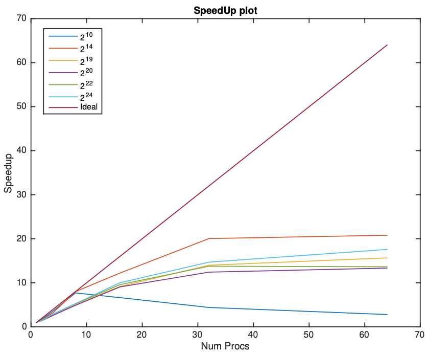
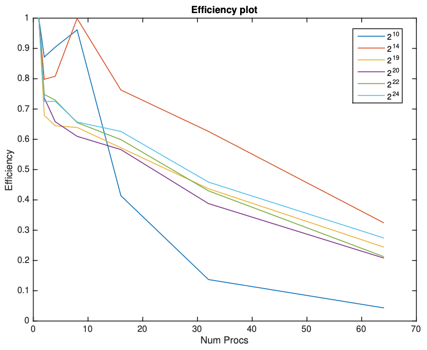
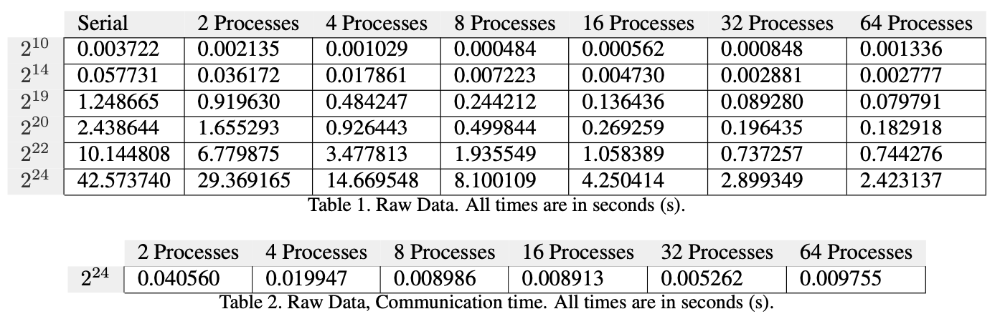

# Parallelization (FFT and Fractals)

## 1. Introduction

In parallel computing, problems are often categorized based on how easily they can be divided into smaller, _independent_ tasks that can be processed in parallel. The two main categories which we will investigate here are **embarrassingly parallel** and **non-embarrassingly parallel** problems.

### Characteristics:
- **Embarrassingly Parallel**:   
  - Each task can be executed independently with no or minimal need for communication between tasks.
  - The speed-up scales near linearly by adding more compute.
- **Non-embarrassingly Parallel**: 
  - Tasks are dependent on one another and require synchronization or communication or data sharing between subproblems.
  - Scaling is not trivial, e.g. you might run into diminishing returns sort of problems (e.g. too much communication overhead).

Here, we will look into two algorithms: 1) the Fast Fourier Transform (non-embarrassingly parallel) and 2) Mandelbrot set calculation (embarrassingly parallel).

## 2. Parallel Fast Fourier Transform (FFT) using MPI

## Overview
This project implements the forward Binary Exchange FFT using parallel processing with MPI (Message Passing Interface) and the Bit Reversal technique. The purpose of the project is to benchmark the method against the non-parallel version of it. The algorithm will generate a random sequence of numbers $\in \mathbb{R}$, of length $N$ (user defined, $N \in  \{2^k : k \in ℕ}\}$), and then it will calculate its FFT. The FFT algorithm has a time complexity of $O(N \log N)$.

## Prerequisites
You need the following installed:
- **MPI Library** (e.g. OpenMPI)
- **GCC or Clang** with MPI support
## Installation , Compilation & Usage
1. Clone the repository:
   ```bash
   git clone https://github.com/ntat/Parallelization_FFT_Fractals.git
   cd FFT
2. Compile using `mpicc`:
   ```bash 
   mpicc -o myfft fft_final.c -lm 
3. Run the program with `mpirun`, specifying the number of processes (`-np`), which _must_ be a power of two:
   ```bash 
   mpirun -np <num_processes> myfft <N> <debugMode> <printResults>
 - `N` (integer): Input size (_must_ be a power of two).
 - `debugMode` (0/1): If `1`, saves the FFT input to `InputFFT.txt`
 - `printResults` (0/1): If `1`, saves the FFT output (in correct order / not bit flipped) to `OutputFFT.txt`
4. Example:
   ```bash 
   mpirun -np 4 myfft 1024 1 1
This will calculate the FFT on 4 processes, and it will return the randomly generated sequence of length N=1024, as well as its FFT calculation in case you need it.

## Results
Results compiled on an Intel Xeon Haswell-based cluster. 
<p  align="center">  
  
  
</p>

<p  align="center">  
  
</p>
